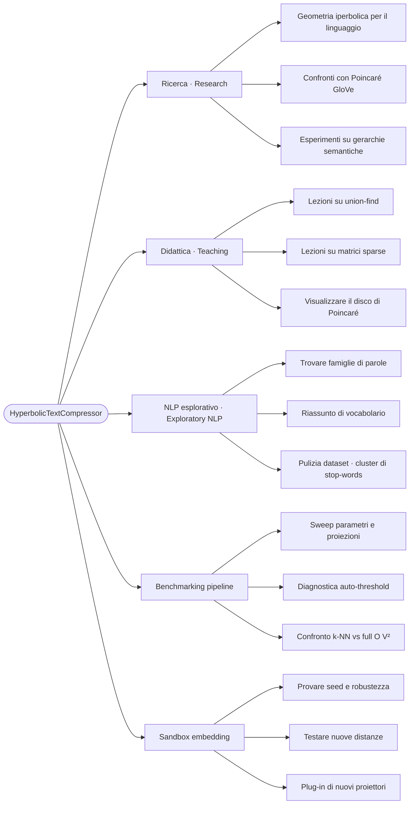
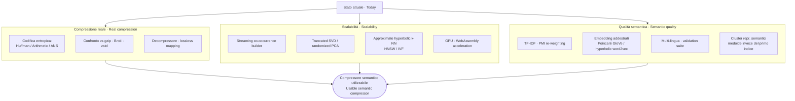

# Diagrammi · Diagrams

Pagina indice dei diagrammi di supporto. La pipeline animata principale è in [`pipeline.html`](./pipeline.html) (richiede un browser).

Index of supporting diagrams. The main animated pipeline lives in [`pipeline.html`](./pipeline.html) (browser required).

---

## Pipeline (statica · static)


Versione interattiva con riproduzione, pausa e didascalie bilingue: [`pipeline.html`](./pipeline.html).

Interactive version with play, pause and bilingual captions: [`pipeline.html`](./pipeline.html).

---

## Limiti · Limitations

```mermaid
mindmap
  root((HyperbolicTextCompressor<br/>Limiti · Limits))
    Compressione "giocattolo"
      Stima = cluster + 50% mappatura
      Non è un codec a livello byte
      Niente confronto con gzip / Brotli
    Costo
      Distanze a coppie O(V²)
      Mitigato da k-NN prefilter (O(V·K))
      Ancora niente streaming
    Sensibilità ai parametri
      windowSize
      clusterThreshold
      projection (random / firstD / svd)
      randomFeaturesPerDim
    Corpora piccoli
      Distanze collassano vicino a 0
      Auto-threshold tende a 1e-6
      Cluster banali
    Lingua e dominio
      Testato su italiano
      Comportamento su altre lingue non validato
      Niente lemmatizzazione, niente stop-words
    Dipendenze opzionali
      SVD richiede ml-matrix o svd-js
      Fallback grazioso se mancano
    Niente decompressore
      Solo stima
      Mappatura non invertibile lossless
```

Sorgente: [`limitations.mmd`](./limitations.mmd).

---

## Casi d'uso · Use cases



Sorgente: [`use-cases.mmd`](./use-cases.mmd).

---

## Roadmap di miglioramenti · Improvement roadmap



Sorgente: [`improvements.mmd`](./improvements.mmd).
