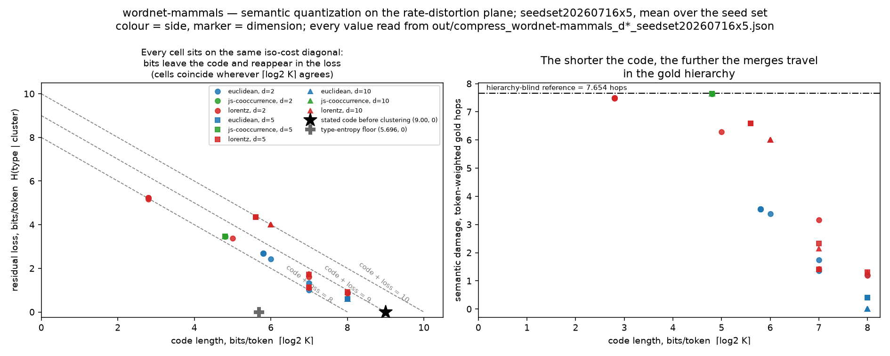

# Cantiere note — phase 2

← [Index](./README.md) · [The story](./story.md) (carta 01)

## 1. The question carta 01 left open

Carta 01 — the story that introduces this project — asked a qualitative question: if the words of a text are mapped into a curved space, the Poincaré disk, instead of a flat one, does hyperbolic geometry capture the language's semantic hierarchies better? It showed the idea with a toy prototype. It did not measure it.

Carta 02 — this phase-2 study — measured it. A reproducible harness (`eval.py`, frozen after phase 1) compares a learned Euclidean embedding against a learned hyperbolic one (the Lorentz manifold, via `geoopt`), on the same hierarchy — a WordNet subset restricted to mammals — with learning rates tuned per geometry, five seeds, mean ± σ throughout.

## 2. The two headline results

**Curvature pays only at d=2, and the ranking flips from d=5 on.** At dimension 2, hyperbolic wins outright: MAP 0.7538 → 0.8957, average distortion 0.3441 → 0.2609. From d=5 on, the Euclidean baseline takes reconstruction: at d=10, MAP 1.0000 / mean rank 1.0000 against hyperbolic's 0.9853 / 2.4549, while the distortion edge does not move monotonically (at d=5, Euclidean 0.2593 against Lorentz's 0.2605 — nearly a tie; at d=10 Lorentz is back ahead, 0.2606 against 0.2927). This reversal carries no budget reservation: a dedicated epoch-budget scan (phase 4b) bracketed the hyperbolic side's plateau above 6000 epochs, so more training would not overturn it.

**The second result concerns the downstream pipeline, and before any of its numbers, here is how much text they describe: 4,616 of 297,697 tokens — 1.55% of the corpus.** Reconnected to the learned embeddings (phase 5), that pipeline computes a ratio — the kind of number that reads, at a glance, like a compression figure — that turns out to anti-correlate with semantic fidelity. Across the full grid (3 sides × 12 percentiles), r(ratio, gold hops) is −0.841 at d=2, −0.992 at d=5, −0.984 at d=10. The best ratio of the three sides (0.5633) belongs to the js-cooccurrence baseline, the most degenerate embedding in the study — 84.9% of its pairwise distances are exactly zero. In bits: code length plus residual loss sits at 7.967–8.885 bits/token at d=2, 8.136–9.950 at d=5, 8.135–10.004 at d=10, against 9.00 bits/token for the same code before any clustering and 5.696 bits/token of raw entropy for the same type stream — bits move, they do not vanish, and in 18 cells the move is a net loss (9.95 / 10.00 bits/token against 9.00). An independent encode→decode round trip confirms the cost accounting to 1.066e-14 bits/token across all 180 checked cells (stated tolerance 1e-9) — the bit count is verified — but at the most faithful operating point (p=0.01) a decoder recovers the exact word only 0.6811 of the time for Euclidean, 0.6250 for Lorentz and 0.5138 for the js-cooccurrence baseline, dropping to 0.2867 at the operating point with the best ratio (Lorentz, p=0.35).

## 3. Why it is called "semantic quantization" now, and why the files still say "compress"

The prose no longer calls this pipeline compression: it calls it **semantic quantization** — types get quantized onto cluster ids — and the honest reading plane is **rate–distortion**, bits per token measured against semantic damage, neither traded silently for the other. File names (`compress.py`, `out/compress_*`) keep their historical spelling: every regenerate command printed in this repository depends on those exact strings, and renaming them would break reproducibility. They are labels, not claims.

## 4. The figure



108 cells (3 sides × 12 percentiles × 3 dimensions). Left panel: code length against residual loss, with iso-cost diagonals and the two zero-loss reference points. Right panel: code length against gold hops, with the hierarchy-blind reference line.

## 5. What this note does not claim

It is not a comparison against `gzip` or any entropy coder — that comparison is out of scope by design, and the 5.696 bits/token entropy figure appears only to show how loose the declared fixed-width code is, never as a rival. It is not evidence that hyperbolic geometry is "better": it wins only in the extreme dimension-starved regime (d=2), on this one hierarchy. A cluster-count-matched comparison (phase 5e) confirmed a pre-registered prediction — at d=10, the Euclidean side produces fewer gold-hierarchy hops than the Lorentz side at every rung of the ladder, with disjoint one-sigma bands only at K=40 (4.856 against 6.506): one clean confirmation out of four, not four independent ones. And it is not a claim of compression in the everyday sense: 98.45% of the corpus's tokens fall outside the mapping, so every ratio in this note describes 1.55% of the text, and nothing else.

## 6. Where the evidence lives

The numbers live in [`FINDINGS.md`](../../phase2/FINDINGS.md) and in the Phase-4, Phase-5, Phase-5d and Phase-5e records of [`phase2/README-fase2.md`](../../phase2/README-fase2.md). The method — Lorentz embeddings, not the Poincaré ball, for gradient stability — comes from Nickel & Kiela (2017, 2018) and Ontrup & Ritter (2001); what is ours is the measurement. Regenerate the figure with:

```
python compress.py --figure rate-distortion --out report/
```

---

← [Index](./README.md)
